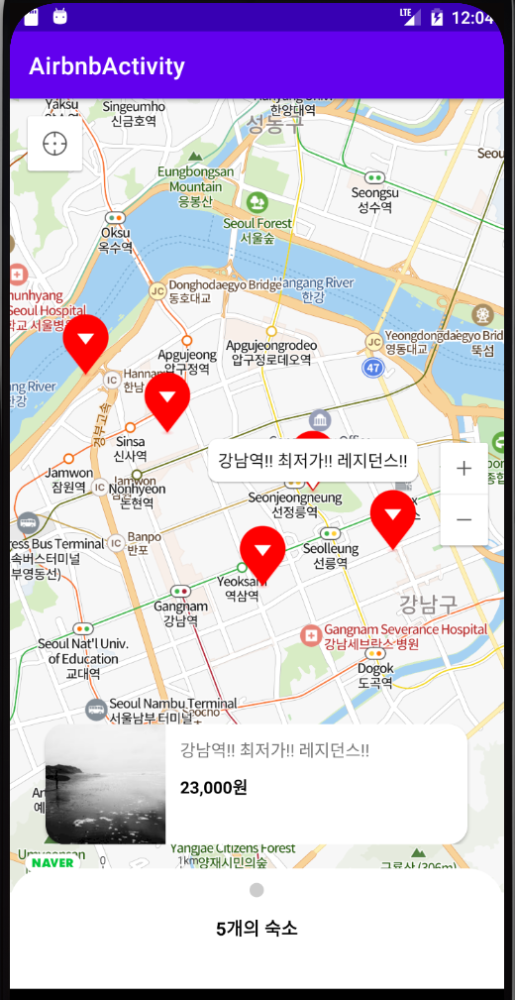
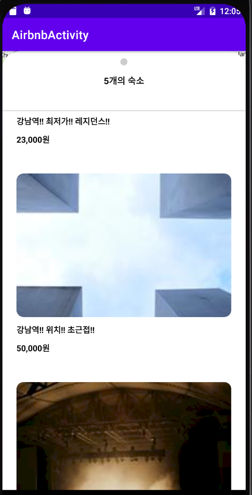

# <에어비엔비 앱>
  
## 에어비엔비 앱

-----

### AndroidFrameWork
    * Naver Map API 사용
    * ViewPager2 사용
    * FrameLayout 사용
    * CoordinatorLayout 사용
    * BottomSheetBehavior 사용
    * Retrofit 사용
    * Glide 사용

### Description
    * Naver Map API를 이용해서 지도를 띄우고 활용 할 수 있음.
    * Mock API 에서 예약가능 숙소 목록을 받아와서 지도에 표시 할 수 있음.
    * BottomSheetView를 활용해서 예약 가능 숙소 목록을 인터렉션하게 표시할 수 있음.
    * ViewPager2를 활용해서 현재 보고있는 숙소를 표시할 수 있음.
    * 숙소버튼을 눌러 현재 보고 있는 숙소를 앱 외부로 공유할 수 있음.

  ---
  
### ScreenShot
---

  &nbsp;&nbsp;&nbsp;
  &nbsp;&nbsp;&nbsp;

