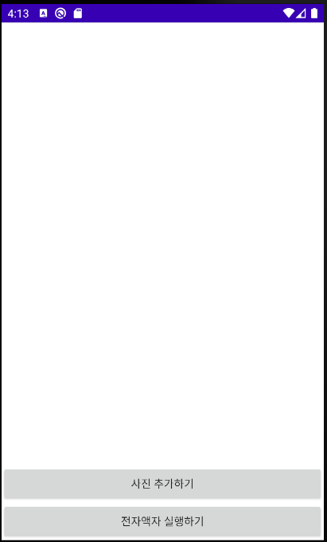
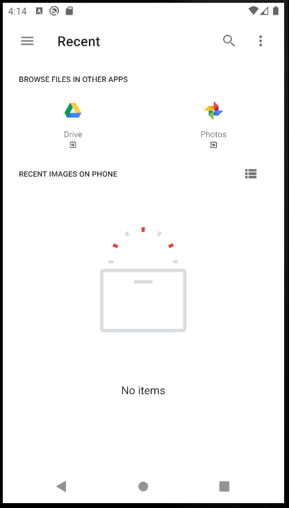
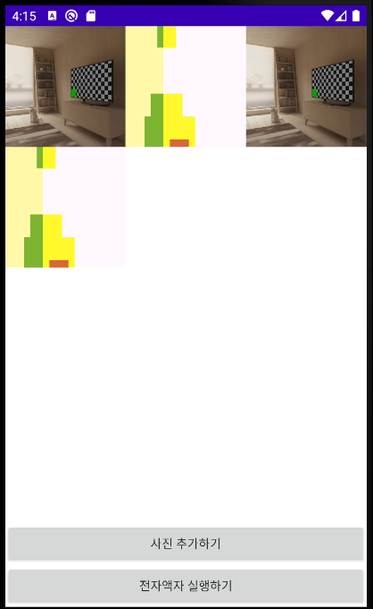
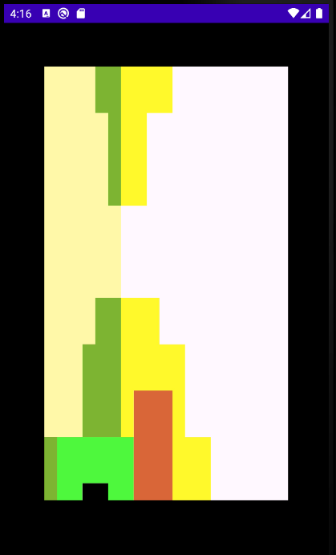

# <전자액자>
  
  ## 전자액자
  
  ### Using Layout and Widget
    * landscape mode
    * Android Permission

  ### Kotlin Grammer
    * View Animation
    * Activity LifeCycle
    * Content Provider :: SAF (Storage Access FrameWork)
  
  ### Description
    * 저장소 접근 권한을 획득하여 로컬 사진을 로드
    * 추가한 사진들을 전환하여 보여줌

  
  ---
  
### ScreenShot
---

  &nbsp;&nbsp;&nbsp;
  &nbsp;&nbsp;&nbsp;
  &nbsp;&nbsp;&nbsp;
  &nbsp;&nbsp;&nbsp;

