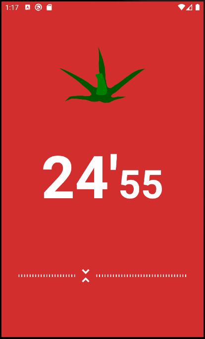

# <Pomodoro Timer>
  
  ## 뽀모도로 타이머
  
  ### Layout and widget
  * SeekBar

  ### Kotlin
  * Timer
  * SoundPool
  
  ### Description
  * 사용자가 시크바를 제어하여 타이머 동작 기능
  * 타이머 동작, 정지 시 사운드 동작
  
  ---
  
### ScreenShot
---

  &nbsp;&nbsp;&nbsp;
  &nbsp;&nbsp;&nbsp;

