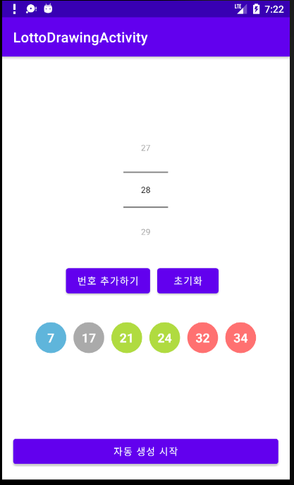
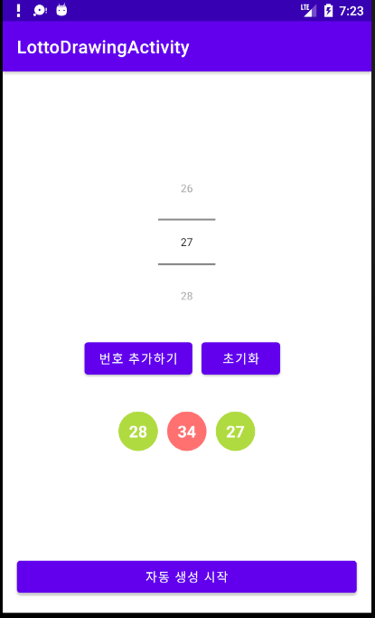
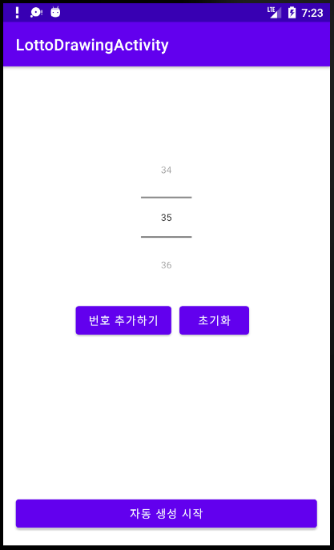

# <로또 추첨기>
  
  ## 로또 추첨기
  
  ### Layout and widget
  - ConstraintLayout
  - Shape Drawable
  - NumberPicker
  - TextView
  - Button

  ### Kotlin
  - apply
  - when
  - Random
  - Collection (Set, List)
  - lambda
  
  ### LOTTO lottery 기능
 - 0~5까지의 숫자를 수동 선택 기능
 - 수동선택한 번호를 제외한 나머지 번호를 랜덤 표시
  
  ---
  
### ScreenShot
---

  &nbsp;&nbsp;&nbsp;
  &nbsp;&nbsp;&nbsp;
  &nbsp;&nbsp;&nbsp;

