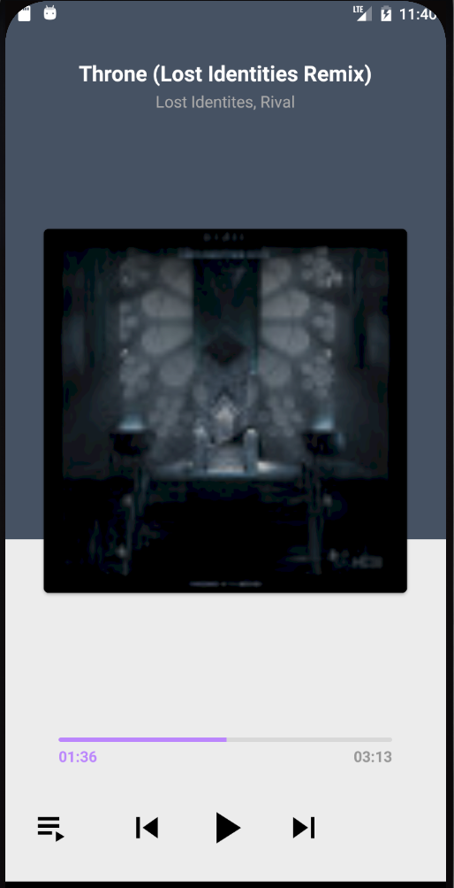
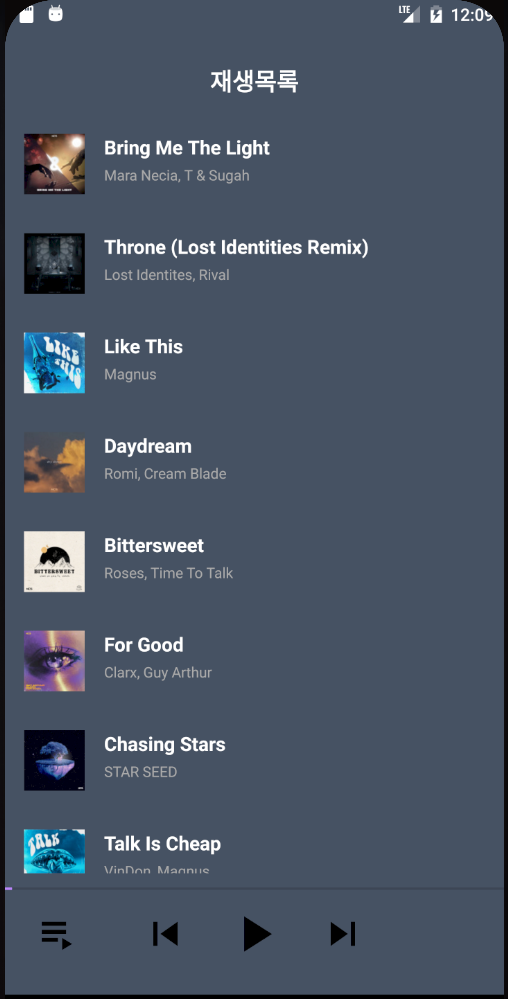

# <뮤직 스트리밍>
  
## 음악 스트리밍

-----

### AndroidFrameWork
    * androidx.constraintlayout.widget.Group
    * Custom Seekbar

### MotionLayout
    * ConstraintLayout 라이브러리 (서브 클래스)
    * 레이아웃  전환과 UI 이동, 크기 조절 및 애니메이션 사용
    * OTT앱 인트로

### ExoPlayer
    * Custom controller
    * Playlist
    * Google이 Android SDK와 별도로 배포하는 오픈소스 프로젝트
    * 오디오 및 동영상 재생 기능
    * 오디오 및 동영상 재생 관련 강력한 기능들 포함
    * 유튜브 앱에서 사용하는 라이브러리

### 음악 스트리밍 앱
    * Retrofit을 이용하여 재생 목록을 받아와 구성
    * 재생 목록을 클릭하여 ExoPlayer를 이용하여 음악을 재생
    * 이전, 다음 트랙버튼을 눌러서 이전, 다음 음악으로 재생하고, UI를 업데이트 함
    * PlayList화면과 Player화면 간의 전환을 할 수 있음
    * Seekbar를 custom하여 원하는 UI로 표시 할 수 있음
  ---
  
### ScreenShot
---

  &nbsp;&nbsp;&nbsp;
  &nbsp;&nbsp;&nbsp;

