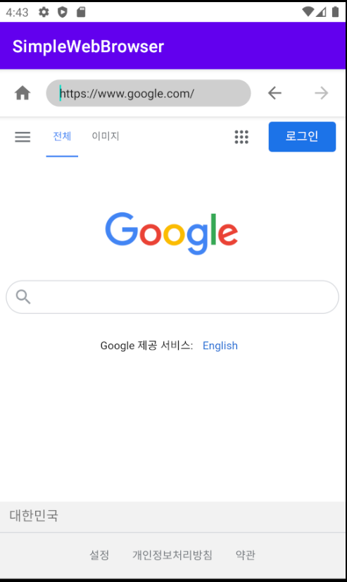
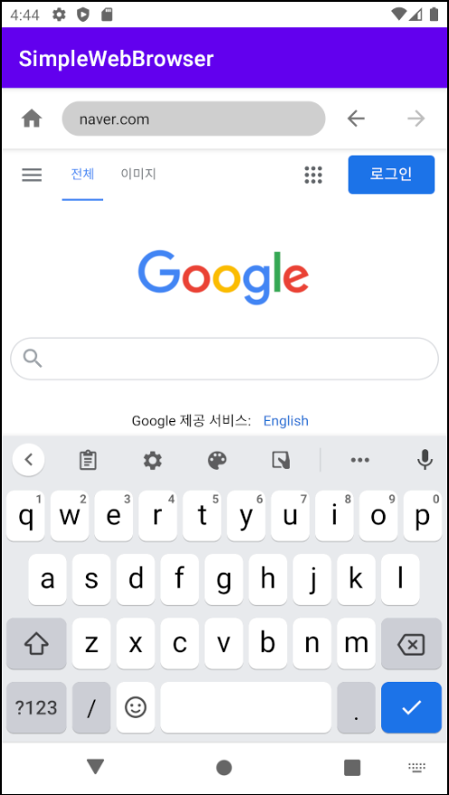

  
  ## 간단한 웹브라우저
  
  ### Layout and widget
    * SwiperefreshLayout
    * ConstraintLayout
    * ContentLoadingProgressBar
    * WebView
    * EditText

  ### Kotlin
    * setOnEditorActionListener
    * WebChromeClient
    * WebViewClient
  
  ### Description
    * 웹사이트 로드 기능
    * 뒤로가기, 앞으로 가기 기능
    * 홈 버튼 클릭을 통한 초기 페이지 전환
    * 웹사이트의 로딩 정도 표시
  
  ---
  
### ScreenShot
---

  &nbsp;&nbsp;&nbsp;
  &nbsp;&nbsp;&nbsp;

