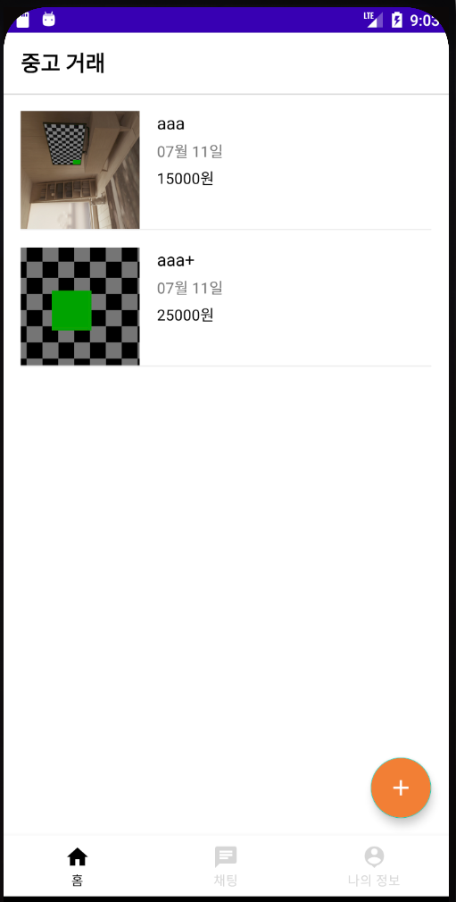
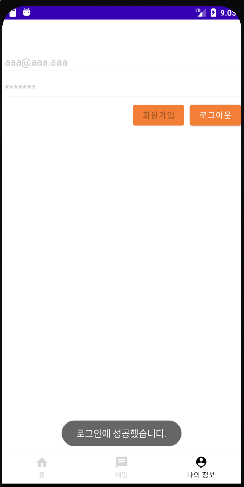
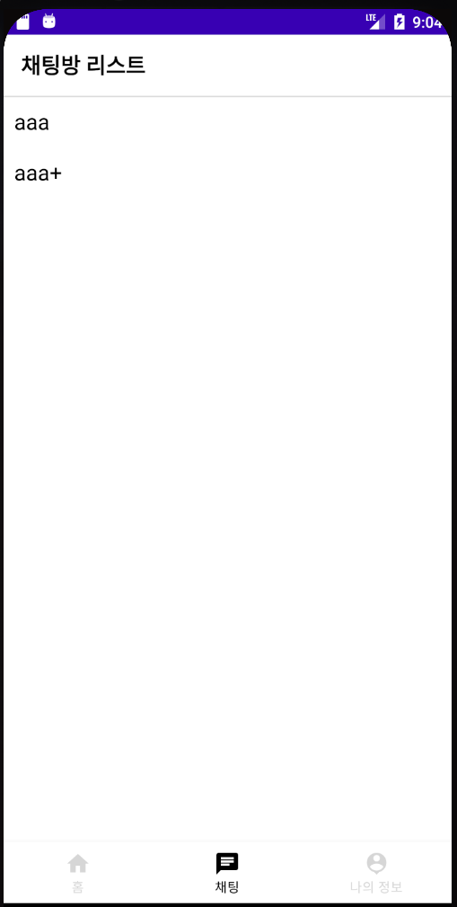
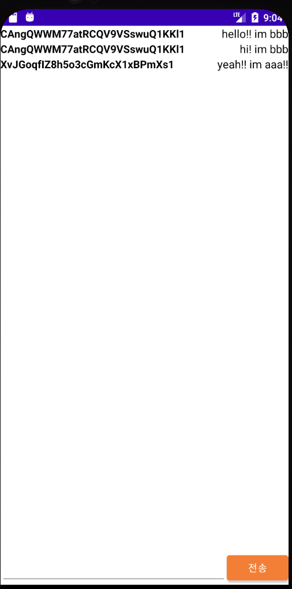

# <중고거래 앱>
  
## 중고거래 예제

-----

### AndroidFrameWork
    * RecyclerView 사용
    * View Binding 사용
    * Fragment 사용
    * BottomNavigationView 사용
    * Firebase Storage 사용
    * Firebase Realtime Database 사용
    * Firebase Authentication 사용

### Description
    * Firebase Authentication 기능을 사용하여 로그인 회원가입 기능을 구현 할 수 있음.
    * 회원 기반으로 중고거래 아이템을 등록 할 수 있음.
    * 아이템 등록 시 사진 업로드를 위해 Firebase Storage를 사용 할 수 있음.
    * 회원 기반으로 채팅 화면을 구현 할 수 있음.
    * Fragment를 사용하여 하단 탭 화면 구조를 구현 할 수 있음.
    * FloatingActionButton을 사용하여 하단 탭 화면 구조를 구현 할 수 있음.
    * FloatingActionButton을 사용하기

  ---
  
### ScreenShot
---

  &nbsp;&nbsp;&nbsp;
  &nbsp;&nbsp;&nbsp;
  &nbsp;&nbsp;&nbsp;
    &nbsp;&nbsp;&nbsp;

