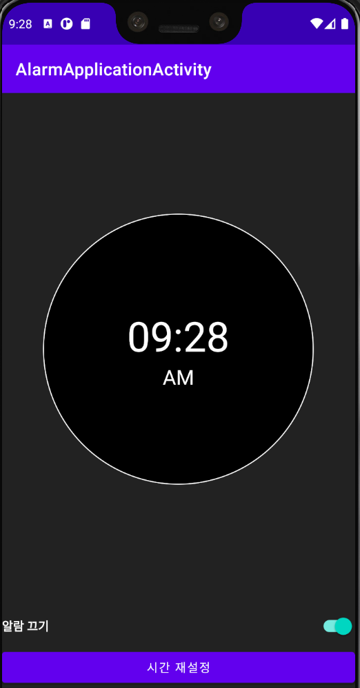
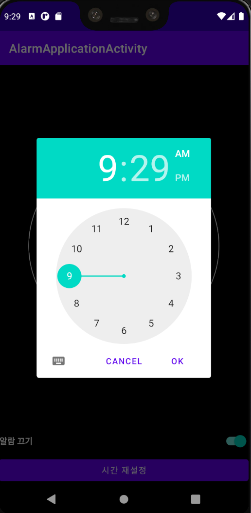
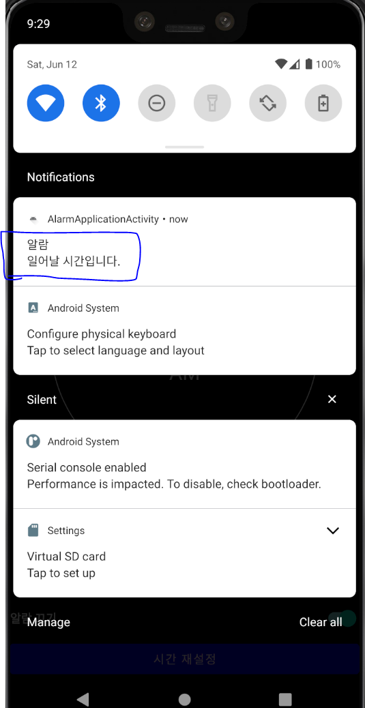

# <Alarm Application>
  
  ## 간단한 알람앱
  
### AndroidFrameWork
    * AlarmManager
    * Notification
    * Broadcast receiver

### Background
    * Immediate tasks (즉시 실행해야하는 작업)
    * Thread
    * Handler
    * Kotlin coroutines

    * Deferred tasks(지연된 작업)
    * workmanager

    * Exact tasks(정시에 실행해야 하는 작업)
    * AlarmManager

### AlarmManager
    * Real Time(실제 시간)으로 실행시키는 방법
    * Elapsed Time(기기가 부팅된지부터 얼마나 지났는지)으로 실행시키는 방법

### Description
    * 지정된 시간에 알람이 울리게 함.
    * 지정된 시간 이후에는 매일 같은 시간에 반복되게 알람이 울리게 함.

  
  ---
  
### ScreenShot
---

  &nbsp;&nbsp;&nbsp;
  &nbsp;&nbsp;&nbsp;
  &nbsp;&nbsp;&nbsp;

