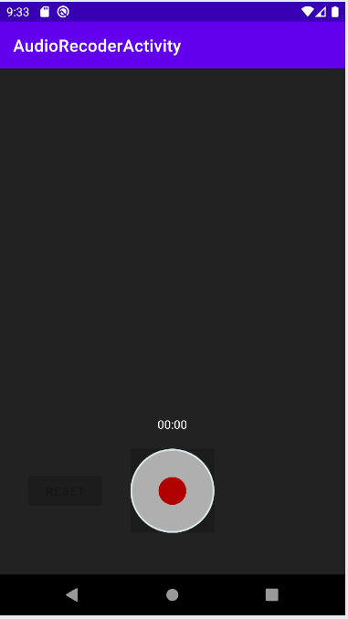
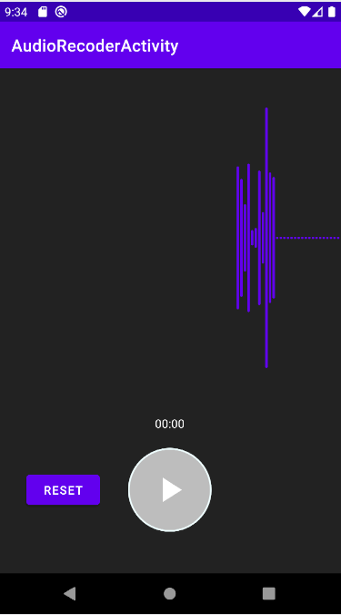
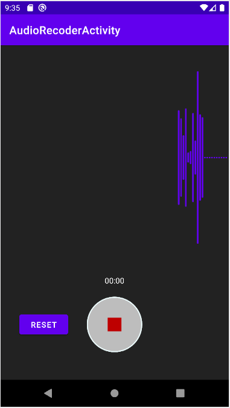
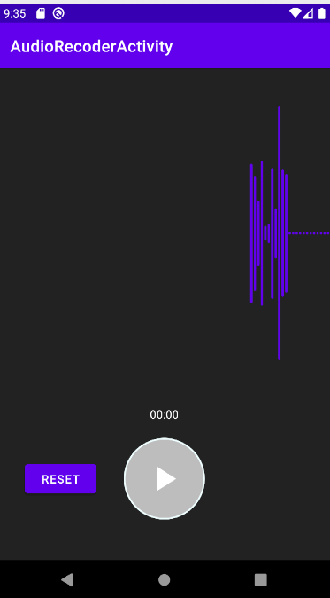
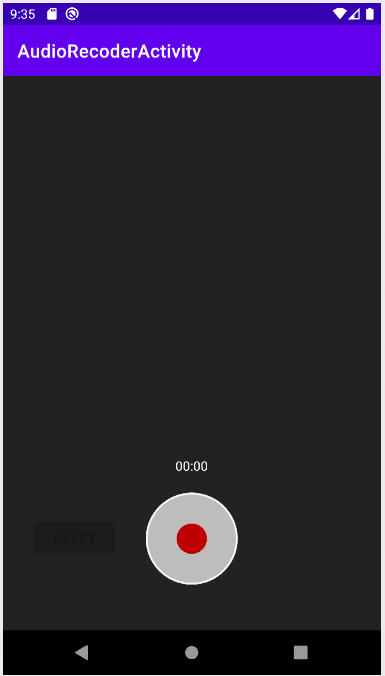

# <Pomodoro Timer>
  
  ## 녹음기
  
  ### Layout and widget
    * Request runtime permissions
    * CustomView
    * MediaRecoder

  ### Kotlin
    * Runnable(Thread)
    * variable(lambda)
  
  ### Description
    * 마이크를 통해 음성을 녹음
    * 녹음한 음성을 재생
    * 음성을 시각화
  
  ---
  
### ScreenShot
---

  &nbsp;&nbsp;&nbsp;
  &nbsp;&nbsp;&nbsp;
  &nbsp;&nbsp;&nbsp;
  &nbsp;&nbsp;&nbsp;
  &nbsp;&nbsp;&nbsp;

