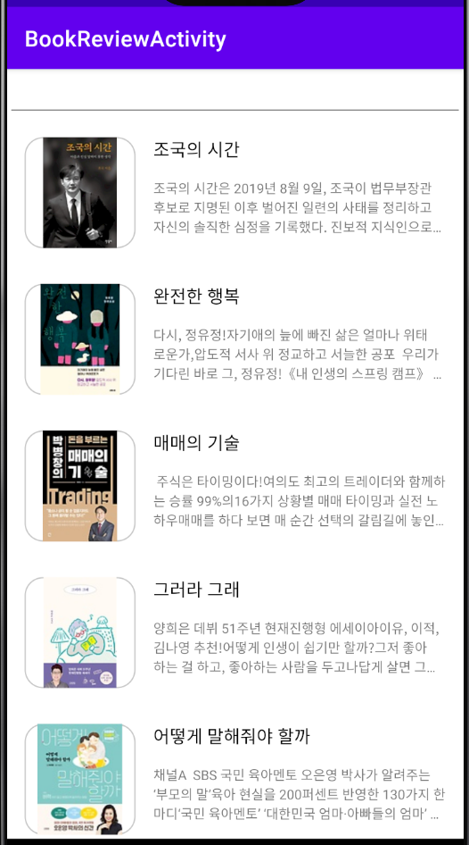
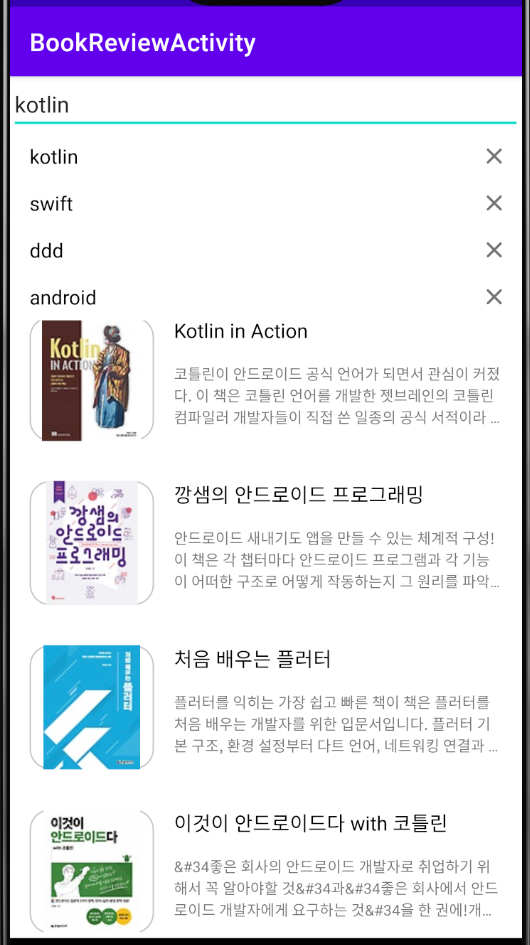
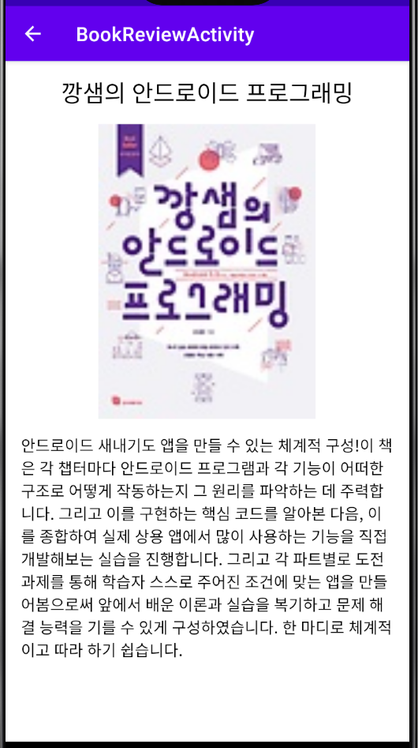
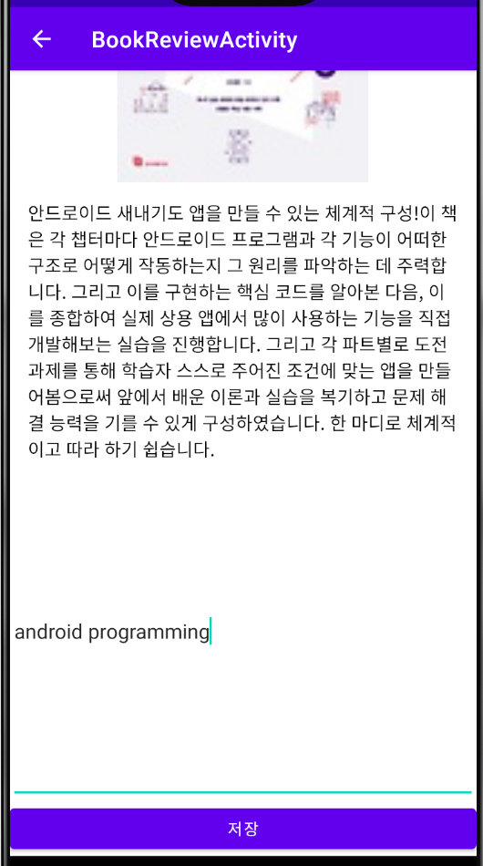

# <BookReview_Application>
  
  ## 도서 리뷰앱
  
### AndroidFrameWork
    * RecyclerView
    * View Binding
    * Retrofit
    * Glide
    * Android Room
    * Open Api

### Description
    * 인터파크 Open API를 통해 베스트셀러 정보를 가져와서 화면에 그릴 수 있음.
    * 인터파크 Open API를 통해 검색어에 해당하는 책 목록을 가져와서 화면에 그릴 수 있음
    * Local DB를 이용하여 검색 기록을 저장하고 삭제할 수 있음.
    * Local DB를 이용하여 개인 리뷰를 저장 할 수 있음.

  ---
  
### ScreenShot
---

  &nbsp;&nbsp;&nbsp;
  &nbsp;&nbsp;&nbsp;
  &nbsp;&nbsp;&nbsp;
    &nbsp;&nbsp;&nbsp;

