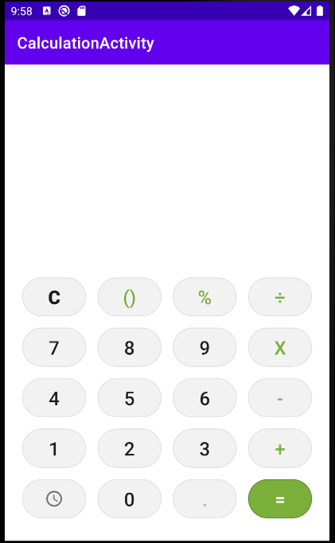
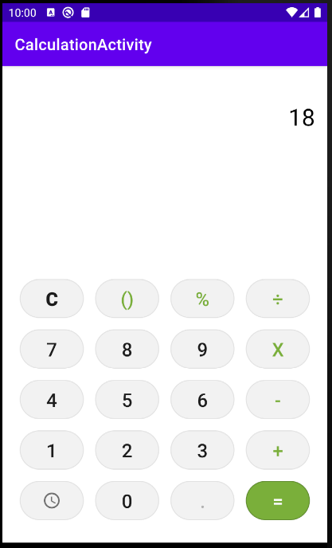
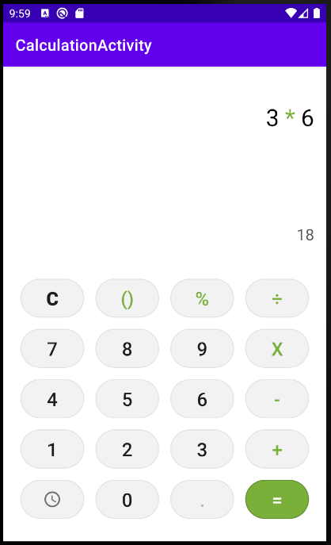
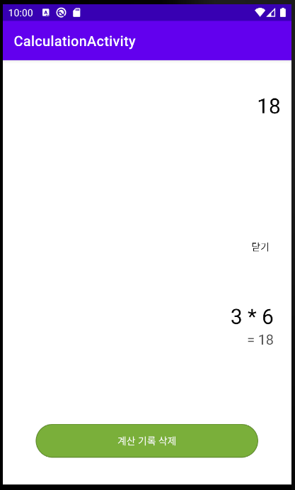

# <계산기>
  
  ## 계산기
  
  ### Using Layout and Widget
    * TableLayout
    * ConstraintLayout
    * LayoutInflater
    * Shape drawble

  ### Kotlin Grammer
    * Thread
    * Room(DB)
    * dataClass
    * Kotlin Extention Function
  
  ### Description
    * 계산기 기능 수행
    * 계산 기록 데이터베이스 저장
    * 단, 정수한정, 괄호, Dot(.)기능 제외, 단일연산기능 수행
  
  ---
  
### ScreenShot
---

  &nbsp;&nbsp;&nbsp;
  &nbsp;&nbsp;&nbsp;
  &nbsp;&nbsp;&nbsp;
  &nbsp;&nbsp;&nbsp;

