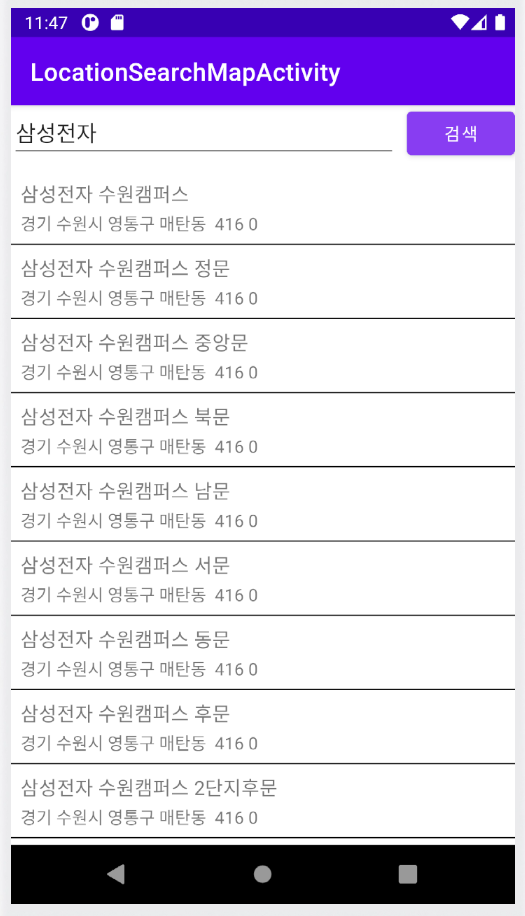

# <위치 검색 앱>
  
## 위치 검색 앱

-----

### 구현 기능 소개
#### 검색 화면
    * POI
    * Retrofit
    * GSON
    * RecyclerView
    * Coroutines

#### 지도 위치 화면
    * GoogleMap
    * Intent

#### 현재 내 위치 기능
    * GoogleMap
    * POI Geo Reverse
    * Retrofit
    * GSON
  ---
  
### ScreenShot
---

  &nbsp;&nbsp;&nbsp;
  &nbsp;&nbsp;&nbsp;

