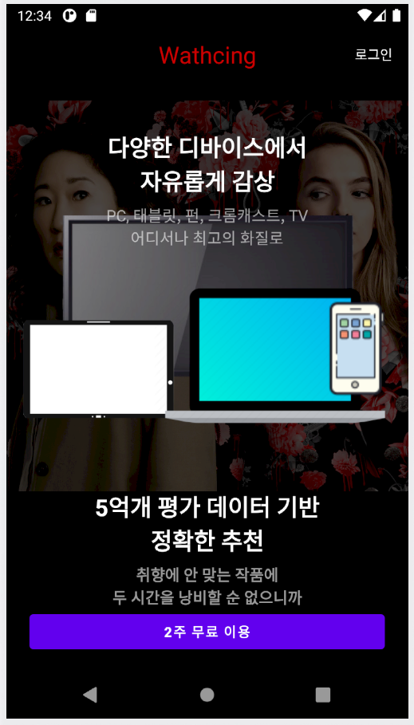
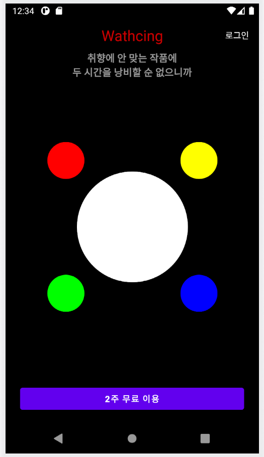

# <OTT앱>
  
## OTT앱

-----

### 구현 기능 소개
#### 모션레이아웃
    * ScrollView
    * MotionLayout
    * ConstraintLayout
    * ConstraintSet

#### 헤더 영역 
    * AppBar
    * CollapsingToolbar
    * Inset(FitSystemWindow)
  ---
  
### ScreenShot
---

  &nbsp;&nbsp;&nbsp;
  &nbsp;&nbsp;&nbsp;
  &nbsp;&nbsp;&nbsp;

#### 결과 화면

| 결과 화면 |
| -------------------------------------- |
|  |
