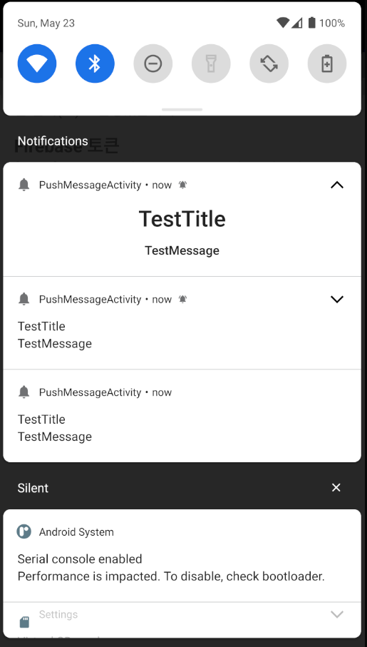
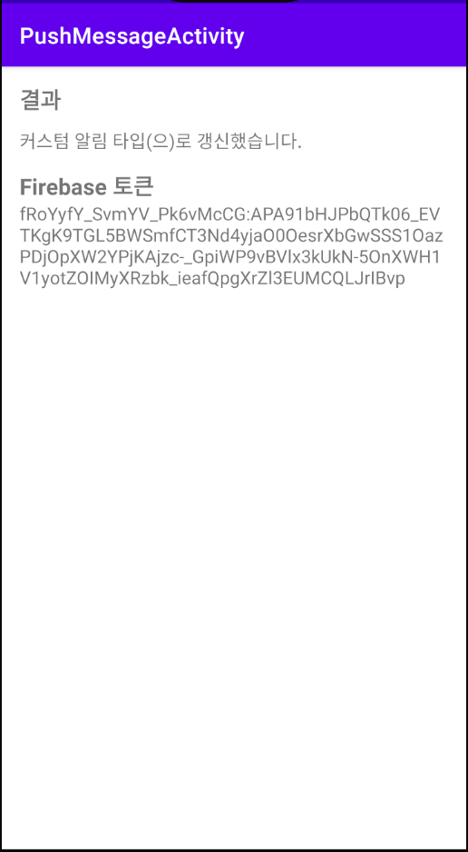

# <푸시 메시지 알람>
  
  ## 푸시 메시지 알람 예제
  
### AndroidFrameWork
    * Firebase Cloud Messaging
    * Notification
    * RemoteView
    * newIntent(SingleTop Flag)
    * panddingIntent

### Description
    * Firebase 토큰 확인
    * 일반, 확장형, 커스텀 알림
    * Json 데이타 구조
    * 알림 수신 시 액션

  
  ---
  
### ScreenShot
---

  &nbsp;&nbsp;&nbsp;
  &nbsp;&nbsp;&nbsp;
  &nbsp;&nbsp;&nbsp;

