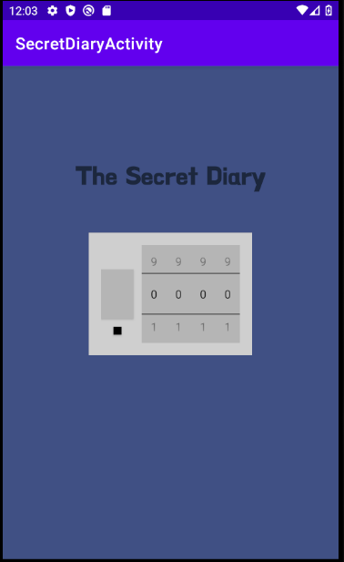
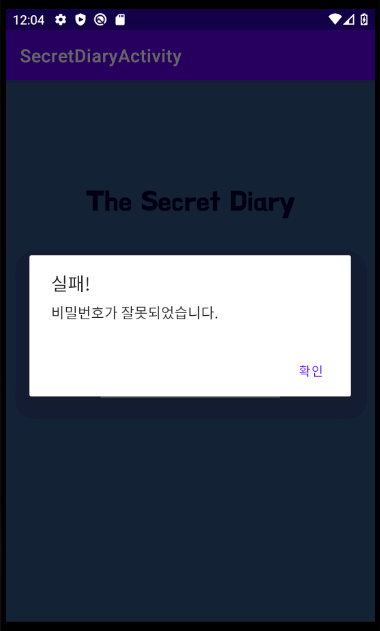
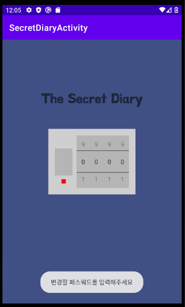
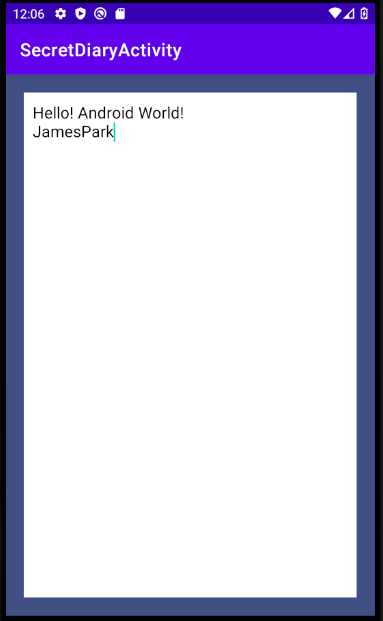

# <비밀다이어리>
  
  ## 비밀다이어리
  
  ### Layout and widget
  - ConstraintLayout
  - Custom Font
  - Theme

  ### Kotlin
  - Thread
  - sharedPreference(android-ktx)
  - AlertDialog
  - Handler
  
  ### 비밀 다이어리 기능
  - 비밀번호를 저장, 변경하는 기능
  - 앱이 종료되도 다이어리 내용을 저장하는 기능
  
  ---
  
### ScreenShot
---

  &nbsp;&nbsp;&nbsp;
  &nbsp;&nbsp;&nbsp;
  &nbsp;&nbsp;&nbsp;
  &nbsp;&nbsp;&nbsp;

