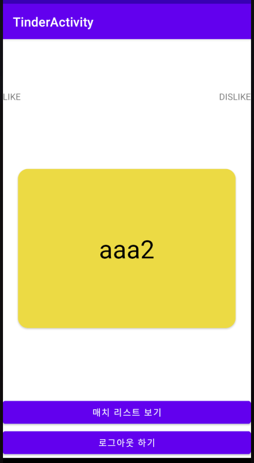
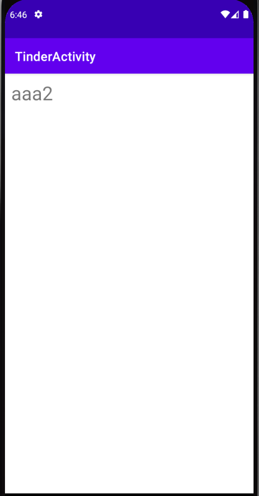

# <틴더>
  
## 틴더 예제

-----

- AndroidFrameWork
    * Email Login
    * Facebook Login
    * Firebase Realtime Database 사용
    * yuyakaido/CardStackView 사용

- Description
    * Firebase Authentication을 통해 이메일 로그인과 페이스북 로그인 구현.
    * Firebase Realtime Database를 이용하여 기록을 저장하고, 불러올 수 있음.
    * Github에서 Opensource Lib를 찾아 사용 할 수 있음.

  ---
  
### ScreenShot
---

  &nbsp;&nbsp;&nbsp;
  &nbsp;&nbsp;&nbsp;
  &nbsp;&nbsp;&nbsp;

