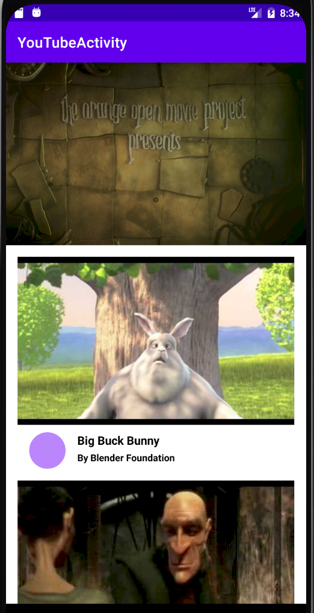
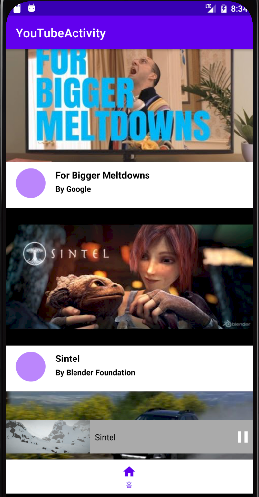

# <유튜브 앱>
  
## 유튜브 앱

-----

### AndroidFrameWork
    * MotionLayout
    * Exoplayer

### MotionLayout
    * ConstraintLayout 라이브러리 (서브 클래스)
    * 레이아웃  전환과 UI 이동, 크기 조절 및 애니메이션 사용
    * OTT앱 인트로

### ExoPlayer
    * Google이 Android SDK와 별도로 배포되는 오픈소스 프로젝트
    * 오디오 및 동영상 재생 기능
    * 오디오 및 동영상 재생 관련 강력한 기능
    * 유튜브 앱에서 사용하는 라이브러리

### YouTube
    * Retrofit을 이용하여 영상 목록을 받아와 구성
    * MotionLayout을 이용하여 유튜브 영상 플레이어 화면전환 애니메이션을 구현.
    * 영상 목록을 클릭하여 ExoPlayer를 이용하여 영상을 재생 할 수 있음.

  ---
  
### ScreenShot
---

  &nbsp;&nbsp;&nbsp;
  &nbsp;&nbsp;&nbsp;

